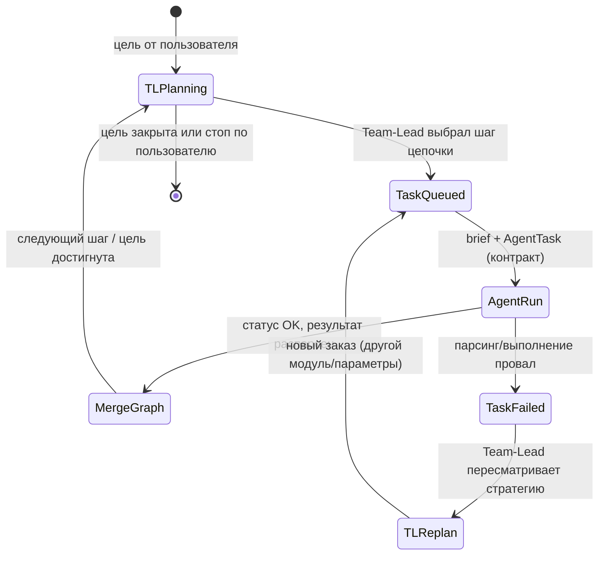
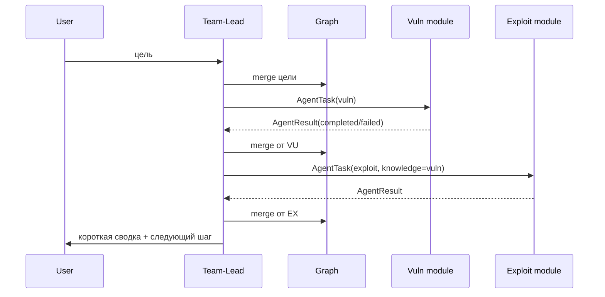
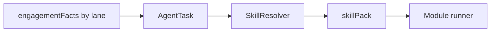
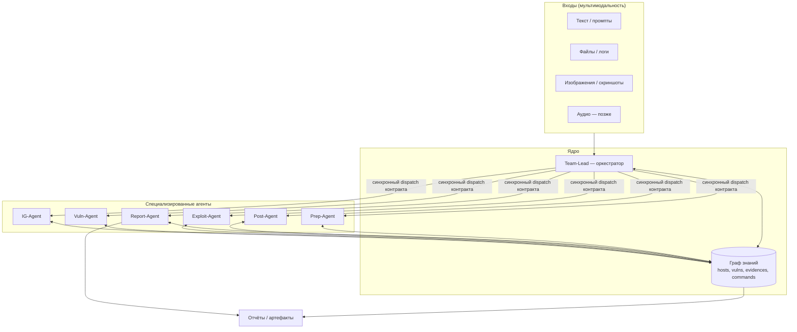
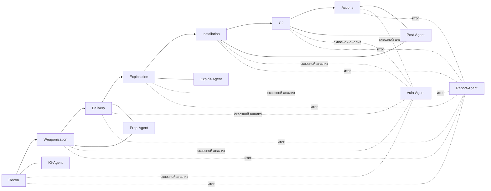
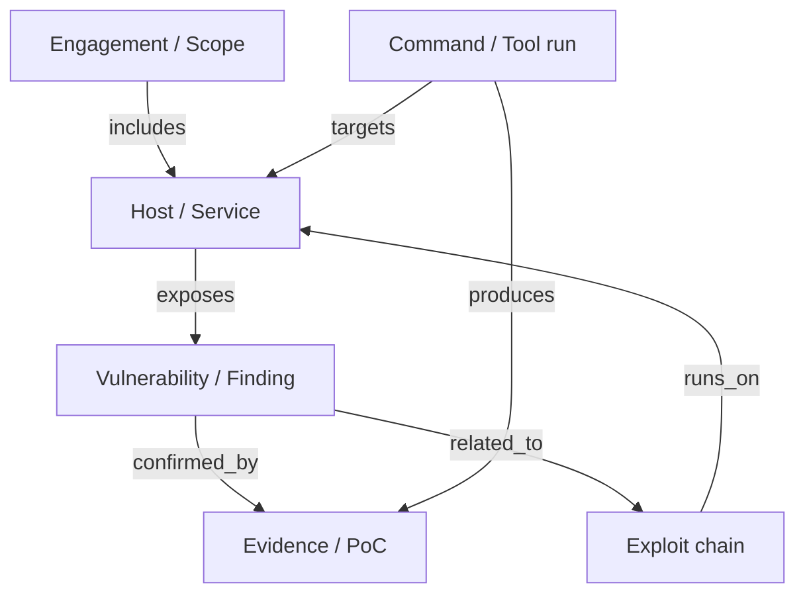

# Pentest Copilot — мультимодальный мультиагентный копилот

Документ для **обсуждения** и **графового** описания продукта. Идея: оркестрация специализированных ИИ-агентов по фазам атаки в духе классической цепочки **Cyber Kill Chain** (и при необходимости расширений MITRE ATT&CK).

---

## 1. Цель продукта

- **Входы**: текст, файлы, скриншоты, логи, выводы инструментов, голос (по мере реализации).
- **Процесс**: агенты с узкими ролями проходят фазы от разведки до отчёта; общий контекст хранится в **графе знаний** (сущности, связи, доказательства).
- **Выходы**: воспроизводимые шаги, артефакты, черновики отчётов, рекомендации по защите.


---

## 2. C2 из «профессионалов»: карта агентов и Kill Chain

| Фаза Kill Chain (упрощённо) | Агент | Фокус |
|----------------------------|--------|--------|
| Reconnaissance | **IG-Agent** (Information Gathering) | OSINT, пассивная/активная разведка, картирование поверхности |
| Weaponization / Delivery *(часто как подготовка)* | **Prep-Agent** | выбор векторов, payloads, сценарии доставки под условия машины / задания |
| Exploitation | **Exploit-Agent** | подтверждение эксплуатируемости, цепочки эксплуатации, обходы |
| Installation / C2 *(если в скоупе)* | **Post-Agent** (Post-Exploitation) | устойчивость, перемещение, сбор флагов и доказательств по ходу задания |
| Actions on Objectives | **Obj-Agent** | закрытие целей задания, демонстрация impact |
| *(сквозная)* | **Vuln-Agent** (Vulnerability Analysis) | корреляция находок, CVSS/контекст, приоритизация |
| *(сквозная)* | **Report-Agent** | отчёт, воспроизводимость, remediation |
| *(оркестрация)* | **Team-Lead** | цель пользователя, порядок Kill Chain, диалог с тобой, **явные** `AgentTask` / приём `AgentResult`, merge в граф, **replan** без болтовни модулей |

**Спеки по каждому модулю** — отдельные файлы: **[docs/agents/index.md](docs/agents/index.md)**. План продолжения на Kali: **[docs/PLAN_KALI.md](docs/PLAN_KALI.md)**.

Имена и границы агентов уточняются в этих документах и по мере реализации.

---

## 3. Язык, контракты и модель выполнения (Team-Lead ↔ агент)

### 3.0. Перед планированием — единая картина

| Узел | Обязанность |
|------|-------------|
| **Team-Lead** | Мозг процесса: цель пользователя, порядок Kill Chain, **постановка задач**, **контроль выполнения** по **`status` в контракте**, merge в граф. Видит **чёткую картину** не из «чата», а из **валидированных** `AgentTask` / `AgentResult` + состояние графа. |
| **Агент-модуль** | Цикл: получить **`knowledge` + задача (`directive`)** → **терминал** (команды, Kali/другой Linux) → **зафиксировать вывод** (stdout/stderr/exit) → **разбор только по этим данным** → отдать Team-Lead **`AgentResult`** (статус + структурированный анализ вывода). Никакого протокольного «попиздеть» между агентом и тимлидом — только контракт. |

**Умные контракты** = типы + парсинг (Zod) + обязательное поле **`status`** и версия **`schemaVersion`**. Всё, что не прошло валидацию, **не считается** выполненным шагом.

**Машинный, автоматизируемый процесс**: минимум свободного текста; поля с **лимитами**; выводы агента оформляются как **утверждения с привязкой к доказательству** (фрагмент вывода, хеш артефакта, id сессии терминала). **Без данных — `unknown` / `not_observed`**, а не заполнение пробелов выдумкой.

**Контекст**: в LLM уходит **узкий срез** (`knowledge` + обрезанный релевантный stdout), а не полная история; цель — **меньше галлюцинаций**, **меньше забивания окна** нерелевантом.

### 3.1. Стек: всё на **TypeScript**

| Слой | Выбор | Зачем |
|------|--------|--------|
| Рантайм оркестрации | **Node.js (LTS)** + **TypeScript** | Один язык от контрактов до раннера; строгие типы end-to-end |
| Контракты Team-Lead ↔ модуль | **TypeScript типы + Zod** (или TypeBox / effect-schema — главное **parse на границе**) | Вход/выход валидируются явно, версия схемы — в поле `schemaVersion` |
| Вызов LLM внутри модуля | HTTP/SDK к провайдеру; **ответ модуля наружу только после парсинга в объект результата** | Нет «простыни в чат» как интерфейса между агентами |
| Работа с тулзами | **Терминал Linux**: subprocess/PTY к окружению (**Kali**, другие дистрибутивы) | Один канал выполнения команд, stdout/stderr/код выхода в артефакты |

Python не обязателен для ядра: тулзы остаются бинарями в Linux, TS только оркестрирует процесс и контракты.

### 3.2. Главное требование: **явный контракт**, никаких «очередей и перехватов»

Оркестрация **не** строится на паттерне «положили задачу в Redis / брокер → агент когда-то подхватил». Такие цепочки часто рвутся, состояние теряется, модели начинают **болтать** ради восстановления контекста — это прямой расход токенов.

**Модель по умолчанию**: Team-Lead в том же процессе/явном вызове делает **`dispatch(moduleId, AgentTaskPayload) → AgentResultPayload`** (или через HTTP к **синхронному** worker-процессу с **таймаутом** и **одним ответом**). Один заказ — одно **готовое** структурированное возвращение или **ошибка/невыполнение** в полях результата.

### 3.3. Жизненный цикл заказа (процесс от пользователя до шага Kill Chain)



Смысл: **задача — выполнение — результат**; при **невыполнении** стратегию пересматривает **только Team-Lead**, не воркер в свободной форме.

### 3.4. Роли: кто думает, кто делает

- **Team-Lead**: держит цель пользователя, порядок фаз Kill Chain, диалог с тобой, **сбор brief** из графа, **выдача заказа** модулю, **replan** при `failed`. Единственный уровень, где уместны рассуждения в свободной форме (и то можно резать системным промптом).
- **Модуль-агент (IG, Vuln, Exploit, …)**: **исполнение заказа и терминал**. Вход — `AgentTask`; выход — **только** валидный `AgentResult`. Свободные рассуждения **не** являются транспортом между модулями; анализ — внутри **`outputFindings`** с **evidenceRef**. Промпт модуля + постобработка обязаны удерживать схему.

### 3.5. Контракты на границе (черновик полей)

Общий каркас **`AgentTask`** (Team-Lead → модуль):

- `schemaVersion`
- `taskId`, `engagementId`, `targetRef`
- `module`: `ig` | `vuln` | `exploit` | …
- `directive` — одна чёткая инструкция (что сделать в этом прогоне)
- `knowledge` — см. структуру ниже (**facts** по ланам + опциональные hints из прошлых отчётов)
- `constraints` — ОС, сервис, версии, лимиты среды (HTB/CTF и т.д.)
- `artifacts` — пути/hashes/вложения, если нужны для выполнения
- **`skillPack`** (подставляет Team-Lead через **SkillResolver**): `schemaVersion`, `toolIds[]`, `skillRefs[]`, `resolvedContent?` (склейка markdown из каталога), `contentHash` (sha256 для воспроизводимости)

**`knowledge`** структурно:

- **`engagementFacts[]`** — факты **текущего** пентеста (IP, порт, CVE…), каждый с полем **`lane`**: `ig | vuln | exploit | post | prep | obj | report`, чтобы потом мержить в граф по направлению.
- **`crossEngagementHints`** (опционально): `priorReportIds[]` + короткие `summaryBullets` из **библиотеки отчётов** прошлых engagement — не смешивать с фактами текущего прогона.

**`AgentResult`** (модуль → Team-Lead):

- `schemaVersion`, `taskId`, **`status`**: `completed` | `failed` | `blocked` (жёстко: без валидного статуса результат отбрасывается)
- `terminalSessions[]` — идемпотентные записи: команда(ы), cwd, env (если нужно), **exitCode**, **stdout/stderr** (с лимитом + truncation flag), время
- `outputFindings[]` — **только из данных терминала/артефактов**: `{ claim, evidenceRef (sessionId + excerpt или artifactId), confidence: high \| medium \| low }`; если вывод неоднозначен — **явно** `inconclusive`, без домысла
- `summary` — одна строка, **жёсткий лимит символов** (служебно для лога UI, не замена телу контракта)
- `graphOps` — патч графа (узлы/рёбра/Evidence)
- `artifacts`, `poc` / `code` — по необходимости, с отсылкой к тому, что реально получено в прогоне
- **`skillPackEcho`** — какие `toolIds` фиксируем как использованные/переданные (отладка, аудит контекста)

**Exploit-модуль** получает в `knowledge` уже **результат vuln-анализа** (или эквивалент из графа); без этого Team-Lead **не** шлёт exploit-заказ.

### 3.6. Терминал и дистрибутивы

- Исполнение идёт в **Linux**: целевое окно — **Kali** и совместимые сценарии; другие дистри — тот же контракт subprocess/PTY.
- Логи терминала — часть **артефактов** и попадают в граф как Evidence, а не как нетипизированный чат.

### 3.7. Истина в графе

- Долговременно храним типизированные факты в **графе**; следующий `AgentTask.knowledge` собирается **из графа + brief Team-Lead**, не из полной истории переписки.

### 3.8. Пример «Vuln → Exploit» (синхронный вызов)



### 3.9. Skills, ланы (lanes) и библиотека отчётов

- **Skills** — файлы в [`packages/skills/catalog`](packages/skills/catalog) (например `nmap.md`, `curl.md`). **SkillResolver** по `module + directive + facts` подбирает `toolIds`, читает markdown и кладёт в `skillPack.resolvedContent` + `contentHash`.
- **Изоляция знаний**: снимок графа на диске — `data/engagements/<engagementId>/graph.json` (не смешиваем engagement между собой).
- **Report library**: после сценария пишется `library/reports/<engagementId>.json` (краткие bullets, затронутые модули). Новый запуск может передать `PRIOR_REPORT_IDS=id1,id2` — в контракт попадут только **сжатые** hints.
- **Team-Lead snapshot** для «картины»: см. `EngagementGraphStore.buildTeamLeadSnapshot()` в коде — компактная сводка узлов/задач, не история чата.



### 3.10. Kali VM: подготовка к SSH (следующий шаг)

1. Сеть: доступ с хоста до гостя по SSH; VPN под HTB — обычно внутри Kali.
2. `openssh-server`, вход по ключу.
3. Пользователь для раннера (например `copilot-runner`), не root.
4. **sudo**: узкие `NOPASSWD` только для перечисленных бинарников или отдельный флаг в `AgentTask.constraints.allowedSudoCommands` (проработка в следующем билде).
5. По возможности ограничить SSH по IP хоста.
6. Переменные окружения для CLI: `KALI_SSH_HOST`, `KALI_SSH_USER`, `KALI_SSH_KEY_PATH`, `KALI_REMOTE_WORKDIR`, опционально `KALI_SSH_STRICT=false` для отключения строгой проверки known_hosts в лабе.

---

## 4. Графовое представление продукта

### 4.1. Высокий уровень: поток данных и оркестрация



### 4.2. Привязка к Kill Chain (фазы ↔ агенты)



### 4.3. Граф знаний (сущности и связи — черновик)



---

## 5. Вопросы для обсуждения (заполнить по мере работы)

- [ ] **Скоуп**: только сетевой пентест или также web / cloud / app?
- [ ] **Kill Chain vs MITRE**: фиксируем одну таксономию или делаем маппинг между ними?
- [ ] **Human-in-the-loop**: какие действия всегда требуют явного подтверждения оператора?
- [ ] **Хранилище графа**: in-memory, файлы, БД (например, property graph)?
- [ ] **Интеграции**: какие инструменты обязательны первыми (nmap, burp, …)?
- [ ] **Мультимодальность**: какие форматы доказательств приоритетны (скрины терминала, HTTP, PCAP)?

*Допишите ответы прямо здесь или в Issues/доках репозитория.*

---

## 6. Следующие шаги (предложение)

1. ~~Каркас монорепо, Zod-контракты, граф, SkillResolver, терминал, демо CLI~~ (v0.5).
2. Подключить **реальный Kali** через `SshKaliTerminal` + первый **HTB** бокс — см. **[docs/PLAN_KALI.md](docs/PLAN_KALI.md)**.
3. Разнести **GenericAgentRunner** на модули с LLM + жёстким JSON-out и реальными командами из `skillPack`.

---

## 7. Репозиторий каркаса (реализация)

Монорепозиторий **npm workspaces** (Node 20+):

| Пакет | Назначение |
|--------|------------|
| `packages/contracts` | Zod: `AgentTask`, `AgentResult`, `GraphOp`, … |
| `packages/skills` | Каталог skill-файлов + `getSkillsCatalogDir()` |
| `packages/terminal` | `TerminalPort`, `LocalStubTerminal`, `SshKaliTerminal` |
| `packages/core` | `EngagementGraphStore`, `SkillResolver`, `GenericAgentRunner`, `TeamLeadRunner`, `ReportLibrary` |
| `apps/cli` | `demo` (батч) и **`session`** — TTY-сессия со slash-командами |
| `docs/agents` | Спецификации модулей (IG, Vuln, Exploit, …) и **Team-Lead** |
| `docs/PLAN_KALI.md` | Чеклист развёртывания и следующих шагов на Kali VM |

Команды из корня:

```bash
npm install
npm run build
npm test
npm run cli           # демо один раз
npm run cli:session   # интерактив (readline), подобие Cursor CLI
```

Переменные для CLI: `DATA_ROOT` (по умолчанию `data`), `LIBRARY_ROOT` (`library`), `ENGAGEMENT_ID`, `PRIOR_REPORT_IDS` (через запятую).

---

## 8. UI: как общаться (TTY и дальше)

Сейчас золотой источник правды — **контракты и граф**, не свободный чат. Пользовательский интерфейс на первом этапе — **терминал**, по духу близкий к **Cursor CLI**: одна длительная сессия, явные команды, структурированный вывод.

| Режим | Что делает |
|--------|------------|
| **`npm run cli` (`demo`)** | Один прогон цепочки без вопросов — для CI и проверки каркаса. |
| **`npm run cli:session` (`session`)** | Приглашение `copilot>`, slash-команды `/snapshot`, `/demo`, `/engagement <id>`, `/quit`. Произвольная строка без `/` попадает в **буфер намерений** (пока без LLM — позже подключится Team-Lead). |

**Дальше (эволюция):**

- Подмешивать **LLM только в Team-Lead** внутри `session`: парсинг намерения → постановка `AgentTask` → печать краткого `AgentResult` + ссылка на узлы графа.
- Опционально тонкий **web** (тот же API контрактов): не замена, а второй фронт.
- Параллельно можно держать **настоящий Cursor CLI** / агента в Cursor, если обвязать вызовом нашего `session` или HTTP-к самому раннеру — но базовая «точка входа» остаётся **явным JSON + граф**.

### 8.1. Идеи «как у Cursor» (бэклог UX)

Зафиксировать на будущую реализацию в `session` / TUI:

| Идея | Смысл |
|------|--------|
| **Горячие клавиши** | Быстрый `/snapshot`, прокрутка последнего `AgentResult`, повтор последней команды, выход — без набора длинных slash-строк (конкретные клавиши подобрать под Windows + POSIX). |
| **`!` во время сессии** | Как у Cursor CLI: префикс **`!`** (или отдельный режим) — **одноразовый shell** на локальной машине или на целевом профиле (позже Kali по SSH), с явным выводом stdout/stderr и возвратом в `copilot>`. Отдельно ограничения по безопасности в лабе. |
| **Выбор «модуля» вместо модели** | Вместо переключения LLM-модели — **фокус контекста**: активный **lane / модуль** (`IG`, `Vuln`, `Exploit`, `Post`, `Report`, …). Это задаёт, куда Team-Lead кладёт следующее намерение и какой `AgentTask.module` создавать по умолчанию — по сути **система «окон»** (одно активное окно = один модуль в цепочке). |
| **Палитра команд** | Набор команд в духе Cursor CLI: поиск по командам, история, автодополнение slash-команд и имён engagement. |

Всё это не меняет протокол между Team-Lead и агентами: снаружи по-прежнему только **валидированные контракты**; TUI лишь удобнее собирает намерение и показывает граф/статус.

---

*Версия документа: 0.6.0 (спеки агентов в docs/agents, план Kali).*
